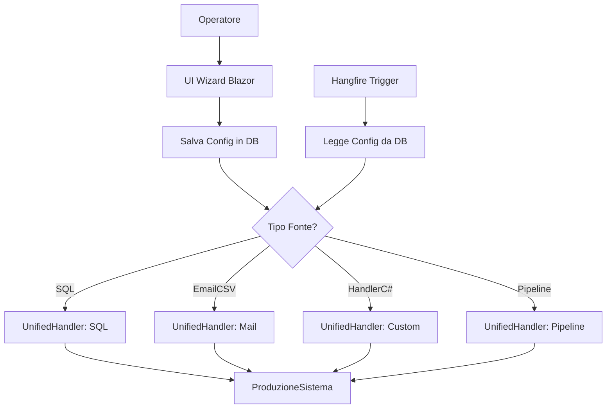

# ?? Sistema Unificato Configurazione Fonti Dati

## Guida Implementazione e Stati di Avanzamento

**Versione**: 1.0  
**Data Inizio**: 2024  
**Stato**: ?? In Corso  
**Effort Stimato**: 10 giorni lavorativi

---

## ?? Indice

1. [Obiettivi](#-obiettivi)
2. [Architettura](#-architettura)
3. [Componenti del Sistema](#-componenti-del-sistema)
4. [Step di Implementazione](#-step-di-implementazione)
5. [Stati di Avanzamento](#-stati-di-avanzamento)
6. [Migration SQL](#-migration-sql)
7. [Entity Framework Models](#-entity-framework-models)
8. [Handler Unificato](#-handler-unificato)
9. [UI Blazor](#-ui-blazor)
10. [Registrazione Servizi](#-registrazione-servizi)
11. [Testing](#-testing)
12. [Cleanup Codice Obsoleto](#-cleanup-codice-obsoleto)
13. [Troubleshooting](#-troubleshooting)

---

## ?? Obiettivi

### Obiettivi Principali

| # | Obiettivo | Priorità | Stato |
|---|-----------|----------|-------|
| 1 | DB come unica source of truth (no JSON automatico) | ?? Alta | ? |
| 2 | Configurazione modificabile da operatori via UI Blazor | ?? Alta | ? |
| 3 | Supporto 4 tipi fonte dati | ?? Alta | ? |
| 4 | Integrazione Hangfire automatica | ?? Media | ? |
| 5 | Backward compatibility sistema esistente | ?? Media | ? |
| 6 | Eliminazione codice obsoleto | ?? Bassa | ? |

### 4 Tipi Fonte Dati Supportati

```
???????????????????????????????????????????????????????????????
?                    TIPI FONTE DATI                          ?
???????????????????????????????????????????????????????????????
?  1. SQL          ? Query diretta a database esterno        ?
?  2. EmailCSV     ? Allegati da servizi email (HERA, ADER4) ?
?  3. HandlerC#    ? Logica complessa (API, algoritmi)       ?
?  4. Pipeline     ? Multi-step (query + filtri + transform) ?
???????????????????????????????????????????????????????????????
```

---

## ??? Architettura

### Schema Generale

```
???????????????????????????????????????????????????????????????
?                    UI BLAZOR (Operatori)                     ?
?  ???????????????????  ???????????????????  ???????????????? ?
?  ? Wizard Config   ?  ? Dashboard Task  ?  ? Diagnostica  ? ?
?  ? Fonte Dati      ?  ? Monitoring      ?  ? Handlers     ? ?
?  ???????????????????  ???????????????????  ???????????????? ?
???????????????????????????????????????????????????????????????
            ?                     ?
            ?                     ?
???????????????????????????????????????????????????????????????
?                    DATABASE (Source of Truth)                ?
?  ??????????????????????????  ?????????????????????????????? ?
?  ? ConfigurazioneFontiDati?  ? TaskDaEseguire            ? ?
?  ? • TipoFonte            ?  ? • IdConfigurazioneDatabase? ?
?  ? • TestoQuery           ?  ? • Scheduling              ? ?
?  ? • MailServiceCode      ?  ? • Enabled                 ? ?
?  ? • HandlerClassName     ?  ?                           ? ?
?  ??????????????????????????  ?????????????????????????????? ?
?              ?                           ?                   ?
?  ??????????????????????????              ?                   ?
?  ?ConfigurazioneFaseCentro?              ?                   ?
?  ?ConfigurazionePipeline  ?              ?                   ?
?  ??????????????????????????              ?                   ?
????????????????????????????????????????????????????????????????
                                           ?
                                           ?
???????????????????????????????????????????????????????????????
?                UNIFIED DATA SOURCE HANDLER                   ?
?    switch (config.TipoFonte)                                ?
?      "SQL"            ? ExecuteSqlQueryAsync()              ?
?      "EmailCSV"       ? ExecuteMailServiceAsync()           ?
?      "HandlerIntegrato"? ExecuteCustomHandlerAsync()        ?
?      "Pipeline"       ? ExecutePipelineAsync()              ?
???????????????????????????????????????????????????????????????
                                           ?
                                           ?
???????????????????????????????????????????????????????????????
?                        HANGFIRE                              ?
?  • Recurring Jobs auto-scheduled                            ?
???????????????????????????????????????????????????????????????
                                           ?
                                           ?
???????????????????????????????????????????????????????????????
?                    PRODUZIONE SISTEMA                        ?
???????????????????????????????????????????????????????????????
```

### Flusso Dati



---

## ?? Componenti del Sistema

### Nuovi File da Creare

| File | Progetto | Descrizione | Stato |
|------|----------|-------------|-------|
| `ConfigurazioneFontiDati.cs` | Entities | Entity principale | ? |
| `ConfigurazioneFaseCentro.cs` | Entities | Mapping fasi/centri | ? |
| `ConfigurazionePipelineStep.cs` | Entities | Step pipeline | ? |
| `UnifiedDataSourceHandler.cs` | ClassLibraryLavorazioni | Handler unificato | ? |
| `HandlerDiscoveryService.cs` | ClassLibraryLavorazioni | Discovery reflection | ? |
| `PageConfiguraFonteDati.razor` | BlazorDematReports | Wizard UI | ? |
| `PageListaConfigurazioniFonti.razor` | BlazorDematReports | Dashboard config | ? |

### File da Modificare

| File | Modifica | Stato |
|------|----------|-------|
| `DematReportsContext.cs` | Aggiungi DbSet nuove entities | ? |
| `TaskDaEseguire.cs` | Aggiungi FK `IdConfigurazioneDatabase` | ? |
| `Program.cs` | Registra nuovi servizi | ? |
| `MyNavMenu.razor` | Aggiungi link nuove pagine | ? |
| `PageTaskEdit.razor` | Aggiungi dropdown tipo fonte | ? |

### File da Eliminare (Fase Finale)

| File | Motivo | Stato |
|------|--------|-------|
| Nessuno per ora | Mantieni backward compatibility | ? |

---

## ?? Step di Implementazione

### Fase 1: Foundation (Giorni 1-3)

#### Step 1.1: Migration Database
- [ ] Creare script SQL migration
- [ ] Creare tabella `ConfigurazioneFontiDati`
- [ ] Creare tabella `ConfigurazioneFaseCentro`
- [ ] Creare tabella `ConfigurazionePipelineStep`
- [ ] Aggiungere FK a `TaskDaEseguire`
- [ ] Creare indici performance
- [ ] Creare vista riepilogativa
- [ ] Eseguire migration su DB development
- [ ] Verificare struttura tabelle

#### Step 1.2: Entity Framework Models
- [ ] Creare entity `ConfigurazioneFontiDati`
- [ ] Creare entity `ConfigurazioneFaseCentro`
- [ ] Creare entity `ConfigurazionePipelineStep`
- [ ] Modificare entity `TaskDaEseguire`
- [ ] Aggiornare `DematReportsContext` con DbSet
- [ ] Configurare relationships in `OnModelCreating`
- [ ] Verificare compilazione

#### Step 1.3: Handler Unificato Base
- [ ] Creare `UnifiedDataSourceHandler`
- [ ] Implementare routing per TipoFonte
- [ ] Implementare `ExecuteSqlQueryAsync`
- [ ] Integrare con `UnifiedMailProduzioneService` esistente
- [ ] Implementare `ExecuteCustomHandlerAsync` (reflection)
- [ ] Stub per `ExecutePipelineAsync`
- [ ] Unit test handler

### Fase 2: UI Blazor (Giorni 4-6)

#### Step 2.1: Wizard Configurazione
- [ ] Creare `PageConfiguraFonteDati.razor`
- [ ] Step 1: Selezione tipo fonte
- [ ] Step 2: Dettagli base (codice, nome, descrizione)
- [ ] Step 3: Configurazione specifica per tipo
- [ ] Step 4: Mapping fasi/centri
- [ ] Step 5: Creazione task automatica
- [ ] Componente test query SQL
- [ ] Validazione form

#### Step 2.2: Dashboard Configurazioni
- [ ] Creare `PageListaConfigurazioniFonti.razor`
- [ ] DataGrid con filtri
- [ ] Azioni: modifica, elimina, duplica
- [ ] Indicatore task associati
- [ ] Export configurazioni

#### Step 2.3: Integrazione UI Esistente
- [ ] Modificare `PageTaskEdit.razor`
- [ ] Aggiungere radio button tipo fonte
- [ ] Dropdown configurazioni disponibili
- [ ] Aggiornare `MyNavMenu.razor`
- [ ] Link a nuove pagine admin

### Fase 3: Integration (Giorni 7-8)

#### Step 3.1: Handler Discovery Service
- [ ] Creare `HandlerDiscoveryService`
- [ ] Discovery via reflection
- [ ] Caching risultati
- [ ] Attributi metadata handler
- [ ] Integrazione con UI dropdown

#### Step 3.2: Integrazione Hangfire
- [ ] Modificare `ProductionJobScheduler`
- [ ] Supporto `IdConfigurazioneDatabase`
- [ ] Auto-creazione job da wizard
- [ ] Sync task esistenti
- [ ] Test scheduling

#### Step 3.3: Registrazione Servizi
- [ ] Aggiornare `Program.cs`
- [ ] Registrare `UnifiedDataSourceHandler`
- [ ] Registrare `HandlerDiscoveryService`
- [ ] Verificare DI resolution

### Fase 4: Testing & Cleanup (Giorni 9-10)

#### Step 4.1: Testing End-to-End
- [ ] Test creazione config SQL
- [ ] Test creazione config Mail Service
- [ ] Test creazione config Handler C#
- [ ] Test modifica config ? task usa nuova versione
- [ ] Test esecuzione Hangfire
- [ ] Test UI wizard completo

#### Step 4.2: Migration Dati Esistenti
- [ ] Script conversione handler esistenti
- [ ] Migrazione Z0072370_28AUT a config DB
- [ ] Verifica funzionamento post-migration
- [ ] Rollback plan

#### Step 4.3: Documentazione
- [ ] Guida utente per operatori
- [ ] Documentazione tecnica
- [ ] Aggiornare README

---

## ? Stati di Avanzamento

### Legenda

| Simbolo | Significato |
|---------|-------------|
| ? | Non iniziato |
| ?? | In corso |
| ? | Completato |
| ? | Bloccato |
| ?? | In pausa |

### Progress Tracker

```
FASE 1: FOUNDATION
??? Step 1.1: Migration Database     [?????????] 100%
??? Step 1.2: EF Models              [???????] 100%
??? Step 1.3: Handler Unificato      [???????] 100%

FASE 2: UI BLAZOR
??? Step 2.1: Wizard Config          [????????] 100%
??? Step 2.2: Dashboard              [?????] 100%
??? Step 2.3: Integrazione UI        [????] 100%

FASE 3: INTEGRATION
??? Step 3.1: Discovery Service      [?????] 100%
??? Step 3.2: Hangfire               [?????] 0%
??? Step 3.3: Registrazione          [???] 100%

FASE 4: TESTING & CLEANUP
??? Step 4.1: Testing E2E            [??????] 0%
??? Step 4.2: Migration Dati         [????] 0%
??? Step 4.3: Documentazione         [???] 100%

PROGRESS TOTALE: [??????????] 80%
```

---

## ??? Migration SQL

### File: `docs/migrations/001_ConfigurazioneFontiDati.sql`

```sql
-- =============================================
-- MIGRATION: Sistema Unificato Configurazione Fonti Dati
-- Versione: 1.0
-- Data: 2024
-- =============================================

USE [DematReports]
GO

PRINT '=========================================='
PRINT 'Inizio migration ConfigurazioneFontiDati'
PRINT '=========================================='

-- =============================================
-- 1. TABELLA PRINCIPALE: ConfigurazioneFontiDati
-- =============================================
IF NOT EXISTS (SELECT * FROM sys.tables WHERE name = 'ConfigurazioneFontiDati')
BEGIN
    CREATE TABLE ConfigurazioneFontiDati (
        -- Primary Key
        IdConfigurazione INT PRIMARY KEY IDENTITY(1,1),
        
        -- Identificazione
        CodiceConfigurazione VARCHAR(100) NOT NULL,
        NomeConfigurazione NVARCHAR(200) NOT NULL,
        DescrizioneConfigurazione NVARCHAR(500) NULL,
        
        -- Tipo fonte dati: SQL, EmailCSV, HandlerIntegrato, Pipeline
        TipoFonte VARCHAR(50) NOT NULL,
        
        -- Configurazione SQL
        TestoQuery NVARCHAR(MAX) NULL,
        ConnectionStringName VARCHAR(100) NULL,
        
        -- Configurazione Email (riferimento a sezione appsettings.json)
        MailServiceCode VARCHAR(100) NULL,
        
        -- Configurazione Handler C# Integrato
        HandlerClassName VARCHAR(200) NULL,
        
        -- Metadata
        CreatoDa VARCHAR(100) NULL,
        CreatoIl DATETIME DEFAULT GETDATE(),
        ModificatoDa VARCHAR(100) NULL,
        ModificatoIl DATETIME NULL,
        FlagAttiva BIT DEFAULT 1,
        
        -- Constraints
        CONSTRAINT UQ_ConfigFonte_Codice UNIQUE (CodiceConfigurazione),
        CONSTRAINT CK_ConfigFonte_TipoFonte 
            CHECK (TipoFonte IN ('SQL', 'EmailCSV', 'HandlerIntegrato', 'Pipeline'))
    );
    
    PRINT '? Tabella ConfigurazioneFontiDati creata'
END
ELSE
BEGIN
    PRINT '?? Tabella ConfigurazioneFontiDati già esistente'
END
GO

-- =============================================
-- 2. TABELLA: ConfigurazioneFaseCentro
-- =============================================
IF NOT EXISTS (SELECT * FROM sys.tables WHERE name = 'ConfigurazioneFaseCentro')
BEGIN
    CREATE TABLE ConfigurazioneFaseCentro (
        -- Primary Key
        IdFaseCentro INT PRIMARY KEY IDENTITY(1,1),
        
        -- Foreign Key
        IdConfigurazione INT NOT NULL,
        
        -- Mapping
        IdProceduraLavorazione INT NOT NULL,
        IdFaseLavorazione INT NOT NULL,
        IdCentro INT NOT NULL,
        
        -- Query override per questa combinazione (opzionale)
        TestoQueryOverride NVARCHAR(MAX) NULL,
        
        -- Parametri extra in JSON (es: {"department": "GENOVA"})
        ParametriExtra NVARCHAR(MAX) NULL,
        
        -- Mapping colonne in JSON (es: {"Operatore": "OP_SCAN"})
        MappingColonne NVARCHAR(MAX) NULL,
        
        FlagAttiva BIT DEFAULT 1,
        
        -- Constraints
        CONSTRAINT FK_FaseCentro_Configurazione 
            FOREIGN KEY (IdConfigurazione)
            REFERENCES ConfigurazioneFontiDati(IdConfigurazione)
            ON DELETE CASCADE,
            
        CONSTRAINT FK_FaseCentro_Procedura 
            FOREIGN KEY (IdProceduraLavorazione)
            REFERENCES ProcedureLavorazioni(IdproceduraLavorazione),
            
        CONSTRAINT FK_FaseCentro_Fase 
            FOREIGN KEY (IdFaseLavorazione)
            REFERENCES FasiLavorazione(IdFaseLavorazione),
            
        CONSTRAINT FK_FaseCentro_Centro 
            FOREIGN KEY (IdCentro)
            REFERENCES CentriLavorazione(IdCentro),
            
        CONSTRAINT UQ_FaseCentro_Unique 
            UNIQUE (IdConfigurazione, IdProceduraLavorazione, IdFaseLavorazione, IdCentro)
    );
    
    PRINT '? Tabella ConfigurazioneFaseCentro creata'
END
ELSE
BEGIN
    PRINT '?? Tabella ConfigurazioneFaseCentro già esistente'
END
GO

-- =============================================
-- 3. TABELLA: ConfigurazionePipelineStep
-- =============================================
IF NOT EXISTS (SELECT * FROM sys.tables WHERE name = 'ConfigurazionePipelineStep')
BEGIN
    CREATE TABLE ConfigurazionePipelineStep (
        -- Primary Key
        IdPipelineStep INT PRIMARY KEY IDENTITY(1,1),
        
        -- Foreign Key
        IdConfigurazione INT NOT NULL,
        
        -- Step info
        NumeroStep INT NOT NULL,
        NomeStep NVARCHAR(100) NOT NULL,
        TipoStep VARCHAR(50) NOT NULL,
        
        -- Configurazione step in JSON
        ConfigurazioneStep NVARCHAR(MAX) NOT NULL,
        
        FlagAttiva BIT DEFAULT 1,
        
        -- Constraints
        CONSTRAINT FK_Pipeline_Configurazione 
            FOREIGN KEY (IdConfigurazione)
            REFERENCES ConfigurazioneFontiDati(IdConfigurazione)
            ON DELETE CASCADE,
            
        CONSTRAINT CK_Pipeline_TipoStep 
            CHECK (TipoStep IN ('Query', 'Filter', 'Transform', 'Aggregate', 'Merge'))
    );
    
    PRINT '? Tabella ConfigurazionePipelineStep creata'
END
ELSE
BEGIN
    PRINT '?? Tabella ConfigurazionePipelineStep già esistente'
END
GO

-- =============================================
-- 4. MODIFICA: TaskDaEseguire - Aggiunta FK
-- =============================================
IF NOT EXISTS (
    SELECT * FROM sys.columns 
    WHERE object_id = OBJECT_ID('TaskDaEseguire') 
    AND name = 'IdConfigurazioneDatabase'
)
BEGIN
    ALTER TABLE TaskDaEseguire
    ADD IdConfigurazioneDatabase INT NULL;
    
    ALTER TABLE TaskDaEseguire
    ADD CONSTRAINT FK_Task_ConfigFonte 
        FOREIGN KEY (IdConfigurazioneDatabase)
        REFERENCES ConfigurazioneFontiDati(IdConfigurazione);
    
    PRINT '? Campo IdConfigurazioneDatabase aggiunto a TaskDaEseguire'
END
ELSE
BEGIN
    PRINT '?? Campo IdConfigurazioneDatabase già esistente'
END
GO

-- =============================================
-- 5. INDICI PER PERFORMANCE
-- =============================================
IF NOT EXISTS (SELECT * FROM sys.indexes WHERE name = 'IX_ConfigFonte_TipoFonte')
BEGIN
    CREATE NONCLUSTERED INDEX IX_ConfigFonte_TipoFonte 
        ON ConfigurazioneFontiDati(TipoFonte) 
        WHERE FlagAttiva = 1;
    PRINT '? Indice IX_ConfigFonte_TipoFonte creato'
END

IF NOT EXISTS (SELECT * FROM sys.indexes WHERE name = 'IX_ConfigFonte_Codice')
BEGIN
    CREATE NONCLUSTERED INDEX IX_ConfigFonte_Codice 
        ON ConfigurazioneFontiDati(CodiceConfigurazione);
    PRINT '? Indice IX_ConfigFonte_Codice creato'
END

IF NOT EXISTS (SELECT * FROM sys.indexes WHERE name = 'IX_FaseCentro_Config')
BEGIN
    CREATE NONCLUSTERED INDEX IX_FaseCentro_Config 
        ON ConfigurazioneFaseCentro(IdConfigurazione);
    PRINT '? Indice IX_FaseCentro_Config creato'
END

IF NOT EXISTS (SELECT * FROM sys.indexes WHERE name = 'IX_Pipeline_Config')
BEGIN
    CREATE NONCLUSTERED INDEX IX_Pipeline_Config 
        ON ConfigurazionePipelineStep(IdConfigurazione, NumeroStep);
    PRINT '? Indice IX_Pipeline_Config creato'
END

IF NOT EXISTS (SELECT * FROM sys.indexes WHERE name = 'IX_Task_ConfigDB')
BEGIN
    CREATE NONCLUSTERED INDEX IX_Task_ConfigDB 
        ON TaskDaEseguire(IdConfigurazioneDatabase) 
        WHERE IdConfigurazioneDatabase IS NOT NULL;
    PRINT '? Indice IX_Task_ConfigDB creato'
END
GO

-- =============================================
-- 6. VISTA RIEPILOGATIVA
-- =============================================
CREATE OR ALTER VIEW vw_ConfigurazioniFontiDatiCompleta AS
SELECT 
    cf.IdConfigurazione,
    cf.CodiceConfigurazione,
    cf.NomeConfigurazione,
    cf.TipoFonte,
    cf.TestoQuery,
    cf.MailServiceCode,
    cf.HandlerClassName,
    cf.ConnectionStringName,
    cf.FlagAttiva AS ConfigAttiva,
    cf.CreatoIl,
    cf.CreatoDa,
    fc.IdFaseCentro,
    fc.IdProceduraLavorazione,
    p.NomeProcedura,
    fc.IdFaseLavorazione,
    f.FaseLavorazione,
    fc.IdCentro,
    c.Centro,
    fc.ParametriExtra,
    fc.MappingColonne,
    fc.TestoQueryOverride,
    (SELECT COUNT(*) 
     FROM TaskDaEseguire t 
     WHERE t.IdConfigurazioneDatabase = cf.IdConfigurazione 
     AND t.Enabled = 1) AS TaskAttivi,
    (SELECT COUNT(*) 
     FROM ConfigurazionePipelineStep ps 
     WHERE ps.IdConfigurazione = cf.IdConfigurazione 
     AND ps.FlagAttiva = 1) AS PipelineSteps
FROM ConfigurazioneFontiDati cf
LEFT JOIN ConfigurazioneFaseCentro fc 
    ON cf.IdConfigurazione = fc.IdConfigurazione AND fc.FlagAttiva = 1
LEFT JOIN ProcedureLavorazioni p 
    ON fc.IdProceduraLavorazione = p.IdproceduraLavorazione
LEFT JOIN FasiLavorazione f 
    ON fc.IdFaseLavorazione = f.IdFaseLavorazione
LEFT JOIN CentriLavorazione c 
    ON fc.IdCentro = c.IdCentro
WHERE cf.FlagAttiva = 1;
GO

PRINT '? Vista vw_ConfigurazioniFontiDatiCompleta creata'

-- =============================================
-- 7. VERIFICA FINALE
-- =============================================
PRINT ''
PRINT '=========================================='
PRINT 'VERIFICA STRUTTURA CREATA'
PRINT '=========================================='

SELECT 
    t.name AS Tabella,
    (SELECT COUNT(*) FROM sys.columns WHERE object_id = t.object_id) AS Colonne,
    (SELECT COUNT(*) FROM sys.indexes WHERE object_id = t.object_id AND is_primary_key = 0 AND is_unique_constraint = 0) AS Indici
FROM sys.tables t
WHERE t.name IN ('ConfigurazioneFontiDati', 'ConfigurazioneFaseCentro', 'ConfigurazionePipelineStep')
ORDER BY t.name;

PRINT ''
PRINT '=========================================='
PRINT '? MIGRATION COMPLETATA CON SUCCESSO!'
PRINT '=========================================='
GO
```

---

## ?? Entity Framework Models

### File: `Entities/Models/DbApplication/ConfigurazioneFontiDati.cs`

```csharp
using System.ComponentModel.DataAnnotations;
using System.ComponentModel.DataAnnotations.Schema;

namespace Entities.Models.DbApplication
{
    /// <summary>
    /// Configurazione unificata per fonti dati.
    /// Supporta: SQL, EmailCSV, HandlerIntegrato, Pipeline.
    /// </summary>
    [Table("ConfigurazioneFontiDati")]
    public partial class ConfigurazioneFontiDati
    {
        [Key]
        public int IdConfigurazione { get; set; }

        [Required]
        [StringLength(100)]
        public string CodiceConfigurazione { get; set; } = null!;

        [Required]
        [StringLength(200)]
        public string NomeConfigurazione { get; set; } = null!;

        [StringLength(500)]
        public string? DescrizioneConfigurazione { get; set; }

        /// <summary>
        /// Tipo fonte: SQL, EmailCSV, HandlerIntegrato, Pipeline
        /// </summary>
        [Required]
        [StringLength(50)]
        public string TipoFonte { get; set; } = null!;

        // Configurazione SQL
        public string? TestoQuery { get; set; }

        [StringLength(100)]
        public string? ConnectionStringName { get; set; }

        // Configurazione Email
        [StringLength(100)]
        public string? MailServiceCode { get; set; }

        // Configurazione Handler C#
        [StringLength(200)]
        public string? HandlerClassName { get; set; }

        // Metadata
        [StringLength(100)]
        public string? CreatoDa { get; set; }

        public DateTime CreatoIl { get; set; } = DateTime.Now;

        [StringLength(100)]
        public string? ModificatoDa { get; set; }

        public DateTime? ModificatoIl { get; set; }

        public bool FlagAttiva { get; set; } = true;

        // Navigation Properties
        public virtual ICollection<ConfigurazioneFaseCentro> ConfigurazioneFaseCentros { get; set; } 
            = new List<ConfigurazioneFaseCentro>();

        public virtual ICollection<ConfigurazionePipelineStep> PipelineSteps { get; set; } 
            = new List<ConfigurazionePipelineStep>();

        public virtual ICollection<TaskDaEseguire> Tasks { get; set; } 
            = new List<TaskDaEseguire>();
    }
}
```

### File: `Entities/Models/DbApplication/ConfigurazioneFaseCentro.cs`

```csharp
using System.ComponentModel.DataAnnotations;
using System.ComponentModel.DataAnnotations.Schema;

namespace Entities.Models.DbApplication
{
    /// <summary>
    /// Mapping configurazione ? procedura/fase/centro.
    /// </summary>
    [Table("ConfigurazioneFaseCentro")]
    public partial class ConfigurazioneFaseCentro
    {
        [Key]
        public int IdFaseCentro { get; set; }

        [Required]
        public int IdConfigurazione { get; set; }

        [Required]
        public int IdProceduraLavorazione { get; set; }

        [Required]
        public int IdFaseLavorazione { get; set; }

        [Required]
        public int IdCentro { get; set; }

        /// <summary>
        /// Query override per questa specifica combinazione fase/centro.
        /// </summary>
        public string? TestoQueryOverride { get; set; }

        /// <summary>
        /// Parametri extra in JSON. Es: {"department": "GENOVA"}
        /// </summary>
        public string? ParametriExtra { get; set; }

        /// <summary>
        /// Mapping colonne in JSON. Es: {"Operatore": "OP_SCAN"}
        /// </summary>
        public string? MappingColonne { get; set; }

        public bool FlagAttiva { get; set; } = true;

        // Navigation Properties
        [ForeignKey("IdConfigurazione")]
        public virtual ConfigurazioneFontiDati Configurazione { get; set; } = null!;

        [ForeignKey("IdProceduraLavorazione")]
        public virtual ProcedureLavorazioni Procedura { get; set; } = null!;

        [ForeignKey("IdFaseLavorazione")]
        public virtual FasiLavorazione Fase { get; set; } = null!;

        [ForeignKey("IdCentro")]
        public virtual CentriLavorazione Centro { get; set; } = null!;
    }
}
```

### File: `Entities/Models/DbApplication/ConfigurazionePipelineStep.cs`

```csharp
using System.ComponentModel.DataAnnotations;
using System.ComponentModel.DataAnnotations.Schema;

namespace Entities.Models.DbApplication
{
    /// <summary>
    /// Step di una pipeline multi-step.
    /// </summary>
    [Table("ConfigurazionePipelineStep")]
    public partial class ConfigurazionePipelineStep
    {
        [Key]
        public int IdPipelineStep { get; set; }

        [Required]
        public int IdConfigurazione { get; set; }

        [Required]
        public int NumeroStep { get; set; }

        [Required]
        [StringLength(100)]
        public string NomeStep { get; set; } = null!;

        /// <summary>
        /// Tipo step: Query, Filter, Transform, Aggregate, Merge
        /// </summary>
        [Required]
        [StringLength(50)]
        public string TipoStep { get; set; } = null!;

        /// <summary>
        /// Configurazione step in JSON.
        /// </summary>
        [Required]
        public string ConfigurazioneStep { get; set; } = null!;

        public bool FlagAttiva { get; set; } = true;

        // Navigation Property
        [ForeignKey("IdConfigurazione")]
        public virtual ConfigurazioneFontiDati Configurazione { get; set; } = null!;
    }
}
```

### Modifica: `TaskDaEseguire.cs`

```csharp
// Aggiungere alla classe esistente:

/// <summary>
/// FK a ConfigurazioneFontiDati per il nuovo sistema unificato.
/// NULL se usa il sistema legacy (IdQuery o QueryIntegrata).
/// </summary>
public int? IdConfigurazioneDatabase { get; set; }

// Navigation Property
[ForeignKey("IdConfigurazioneDatabase")]
public virtual ConfigurazioneFontiDati? ConfigurazioneDatabase { get; set; }
```

### Modifica: `DematReportsContext.cs`

```csharp
// Aggiungere DbSet:
public virtual DbSet<ConfigurazioneFontiDati> ConfigurazioneFontiDatis { get; set; }
public virtual DbSet<ConfigurazioneFaseCentro> ConfigurazioneFaseCentros { get; set; }
public virtual DbSet<ConfigurazionePipelineStep> ConfigurazionePipelineSteps { get; set; }

// In OnModelCreating, aggiungere:
modelBuilder.Entity<ConfigurazioneFontiDati>(entity =>
{
    entity.HasIndex(e => e.CodiceConfigurazione).IsUnique();
    entity.HasIndex(e => e.TipoFonte);
});

modelBuilder.Entity<ConfigurazioneFaseCentro>(entity =>
{
    entity.HasIndex(e => new { e.IdConfigurazione, e.IdProceduraLavorazione, e.IdFaseLavorazione, e.IdCentro })
          .IsUnique();
});

modelBuilder.Entity<ConfigurazionePipelineStep>(entity =>
{
    entity.HasIndex(e => new { e.IdConfigurazione, e.NumeroStep });
});
```

---

## ?? Handler Unificato

### File: `ClassLibraryLavorazioni/Shared/Handlers/UnifiedDataSourceHandler.cs`

```csharp
using Entities.Models.DbApplication;
using LibraryLavorazioni.Lavorazioni.Interfaces;
using LibraryLavorazioni.Lavorazioni.Models;
using LibraryLavorazioni.LavorazioniViaMail.Services;
using Microsoft.Data.SqlClient;
using Microsoft.EntityFrameworkCore;
using Microsoft.Extensions.Configuration;
using Microsoft.Extensions.DependencyInjection;
using Microsoft.Extensions.Logging;
using System.Text.Json;

namespace LibraryLavorazioni.Shared.Handlers
{
    /// <summary>
    /// Handler unificato per TUTTE le fonti dati.
    /// Legge configurazione dal DB ed esegue in base al TipoFonte.
    /// </summary>
    public class UnifiedDataSourceHandler : ILavorazioneHandler
    {
        private readonly IDbContextFactory<DematReportsContext> _dbFactory;
        private readonly IConfiguration _configuration;
        private readonly IServiceProvider _serviceProvider;
        private readonly ILogger<UnifiedDataSourceHandler> _logger;

        public string LavorazioneCode => "UNIFIED_DATASOURCE";

        public UnifiedDataSourceHandler(
            IDbContextFactory<DematReportsContext> dbFactory,
            IConfiguration configuration,
            IServiceProvider serviceProvider,
            ILogger<UnifiedDataSourceHandler> logger)
        {
            _dbFactory = dbFactory;
            _configuration = configuration;
            _serviceProvider = serviceProvider;
            _logger = logger;
        }

        /// <summary>
        /// Esegue elaborazione basata su configurazione DB.
        /// </summary>
        public async Task<List<DatiLavorazione>> ExecuteAsync(
            LavorazioneExecutionContext context,
            CancellationToken ct = default)
        {
            if (!context.IdConfigurazioneDatabase.HasValue)
            {
                throw new InvalidOperationException(
                    "IdConfigurazioneDatabase è richiesto per UnifiedDataSourceHandler");
            }

            // 1. Carica configurazione dal DB
            var config = await LoadConfigurationAsync(context.IdConfigurazioneDatabase.Value, ct);

            if (config == null || !config.FlagAttiva)
            {
                _logger.LogWarning("[UnifiedHandler] Config {Id} non trovata o non attiva",
                    context.IdConfigurazioneDatabase);
                return new List<DatiLavorazione>();
            }

            _logger.LogInformation("[UnifiedHandler] Esecuzione {Codice} (Tipo: {Tipo})",
                config.CodiceConfigurazione, config.TipoFonte);

            // 2. Routing basato su TipoFonte
            return config.TipoFonte switch
            {
                "SQL" => await ExecuteSqlQueryAsync(config, context, ct),
                "EmailCSV" => await ExecuteMailServiceAsync(config, context, ct),
                "HandlerIntegrato" => await ExecuteCustomHandlerAsync(config, context, ct),
                "Pipeline" => await ExecutePipelineAsync(config, context, ct),
                _ => throw new NotSupportedException($"TipoFonte '{config.TipoFonte}' non supportato")
            };
        }

        #region SQL Query Execution

        private async Task<List<DatiLavorazione>> ExecuteSqlQueryAsync(
            ConfigurazioneFontiDati config,
            LavorazioneExecutionContext context,
            CancellationToken ct)
        {
            var result = new List<DatiLavorazione>();

            // Trova mapping per questa fase/centro
            var mapping = config.ConfigurazioneFaseCentros.FirstOrDefault(fc =>
                fc.IdProceduraLavorazione == context.IDProceduraLavorazione &&
                fc.IdFaseLavorazione == context.IDFaseLavorazione &&
                fc.IdCentro == context.IDCentro &&
                fc.FlagAttiva);

            // Usa query override se presente, altrimenti query base
            var query = mapping?.TestoQueryOverride ?? config.TestoQuery;

            if (string.IsNullOrWhiteSpace(query))
            {
                _logger.LogWarning("[UnifiedHandler:SQL] Nessuna query configurata per {Codice}",
                    config.CodiceConfigurazione);
                return result;
            }

            // Sostituisci parametri extra da mapping
            if (!string.IsNullOrWhiteSpace(mapping?.ParametriExtra))
            {
                var extraParams = JsonSerializer.Deserialize<Dictionary<string, string>>(mapping.ParametriExtra);
                if (extraParams != null)
                {
                    foreach (var param in extraParams)
                    {
                        // Sostituzione sicura per parametri stringa
                        query = query.Replace($"@{param.Key}", $"'{param.Value.Replace("'", "''")}'");
                    }
                }
            }

            // Ottieni connection string
            var connectionString = _configuration.GetConnectionString(config.ConnectionStringName!);
            if (string.IsNullOrWhiteSpace(connectionString))
            {
                throw new InvalidOperationException(
                    $"ConnectionString '{config.ConnectionStringName}' non trovata in appsettings.json");
            }

            // Esegui query
            await using var connection = new SqlConnection(connectionString);
            await connection.OpenAsync(ct);

            await using var cmd = new SqlCommand(query, connection);
            cmd.CommandTimeout = 60;
            cmd.Parameters.AddWithValue("@startData", context.StartDataLavorazione.ToString("yyyyMMdd"));
            cmd.Parameters.AddWithValue("@endData",
                (context.EndDataLavorazione ?? context.StartDataLavorazione).ToString("yyyyMMdd"));

            using var reader = await cmd.ExecuteReaderAsync(ct);
            while (await reader.ReadAsync(ct))
            {
                result.Add(MapToDatiLavorazione(reader, mapping?.MappingColonne));
            }

            _logger.LogInformation("[UnifiedHandler:SQL] Eseguita query {Codice}: {Count} record",
                config.CodiceConfigurazione, result.Count);

            return result;
        }

        private DatiLavorazione MapToDatiLavorazione(SqlDataReader reader, string? mappingJson)
        {
            // Mapping colonne: default o custom da configurazione
            var mapping = !string.IsNullOrWhiteSpace(mappingJson)
                ? JsonSerializer.Deserialize<Dictionary<string, string>>(mappingJson)
                : new Dictionary<string, string>
                {
                    ["Operatore"] = "operatore",
                    ["DataLavorazione"] = "DataLavorazione",
                    ["Documenti"] = "Documenti",
                    ["Fogli"] = "Fogli",
                    ["Pagine"] = "Pagine"
                };

            return new DatiLavorazione
            {
                Operatore = SafeGetString(reader, mapping!.GetValueOrDefault("Operatore", "operatore")),
                DataLavorazione = SafeGetDateTime(reader, mapping.GetValueOrDefault("DataLavorazione", "DataLavorazione")),
                Documenti = SafeGetInt(reader, mapping.GetValueOrDefault("Documenti", "Documenti")),
                Fogli = SafeGetInt(reader, mapping.GetValueOrDefault("Fogli", "Fogli")),
                Pagine = SafeGetInt(reader, mapping.GetValueOrDefault("Pagine", "Pagine")),
                AppartieneAlCentroSelezionato = true
            };
        }

        #endregion

        #region Mail Service Execution

        private async Task<List<DatiLavorazione>> ExecuteMailServiceAsync(
            ConfigurazioneFontiDati config,
            LavorazioneExecutionContext context,
            CancellationToken ct)
        {
            // Delega a UnifiedMailProduzioneService esistente
            var mailService = _serviceProvider.GetRequiredService<UnifiedMailProduzioneService>();

            var rowsInserted = config.MailServiceCode switch
            {
                "HERA16" => await mailService.ProcessHera16Async(ct),
                "ADER4" => await mailService.ProcessAder4Async(ct),
                _ => throw new NotSupportedException($"MailServiceCode '{config.MailServiceCode}' non supportato")
            };

            _logger.LogInformation("[UnifiedHandler:Mail] Elaborato {Service}: {Count} righe",
                config.MailServiceCode, rowsInserted);

            // Mail service inserisce direttamente in ProduzioneSistema
            // Ritorna lista vuota perché dati già inseriti
            return new List<DatiLavorazione>();
        }

        #endregion

        #region Custom Handler Execution

        private async Task<List<DatiLavorazione>> ExecuteCustomHandlerAsync(
            ConfigurazioneFontiDati config,
            LavorazioneExecutionContext context,
            CancellationToken ct)
        {
            if (string.IsNullOrWhiteSpace(config.HandlerClassName))
            {
                throw new InvalidOperationException("HandlerClassName non specificato");
            }

            // Risolvi handler C# dal nome classe via reflection
            var handlerType = Type.GetType(
                $"LibraryLavorazioni.Lavorazioni.Handlers.{config.HandlerClassName}, ClassLibraryLavorazioni");

            if (handlerType == null)
            {
                _logger.LogError("[UnifiedHandler:Custom] Handler '{Handler}' non trovato",
                    config.HandlerClassName);
                throw new InvalidOperationException($"Handler {config.HandlerClassName} non trovato");
            }

            // Crea istanza con DI
            var handler = (ILavorazioneHandler)ActivatorUtilities.CreateInstance(_serviceProvider, handlerType);

            _logger.LogInformation("[UnifiedHandler:Custom] Esecuzione handler {Handler}",
                config.HandlerClassName);

            return await handler.ExecuteAsync(context, ct);
        }

        #endregion

        #region Pipeline Execution

        private async Task<List<DatiLavorazione>> ExecutePipelineAsync(
            ConfigurazioneFontiDati config,
            LavorazioneExecutionContext context,
            CancellationToken ct)
        {
            var result = new List<DatiLavorazione>();
            var pipelineData = new List<Dictionary<string, object>>();

            // Ordina step per NumeroStep
            var steps = config.PipelineSteps
                .Where(s => s.FlagAttiva)
                .OrderBy(s => s.NumeroStep)
                .ToList();

            _logger.LogInformation("[UnifiedHandler:Pipeline] Esecuzione {Count} step per {Codice}",
                steps.Count, config.CodiceConfigurazione);

            foreach (var step in steps)
            {
                _logger.LogDebug("[UnifiedHandler:Pipeline] Step {Num}: {Nome} ({Tipo})",
                    step.NumeroStep, step.NomeStep, step.TipoStep);

                var stepConfig = JsonSerializer.Deserialize<Dictionary<string, object>>(step.ConfigurazioneStep);

                pipelineData = step.TipoStep switch
                {
                    "Query" => await ExecutePipelineQueryStepAsync(stepConfig!, config.ConnectionStringName!, context, ct),
                    "Filter" => ApplyPipelineFilter(pipelineData, stepConfig!),
                    "Transform" => ApplyPipelineTransform(pipelineData, stepConfig!),
                    "Aggregate" => ApplyPipelineAggregate(pipelineData, stepConfig!),
                    "Merge" => await MergePipelineDataAsync(pipelineData, stepConfig!, context, ct),
                    _ => throw new NotSupportedException($"TipoStep '{step.TipoStep}' non supportato")
                };
            }

            // Converti risultato finale in DatiLavorazione
            foreach (var item in pipelineData)
            {
                result.Add(new DatiLavorazione
                {
                    Operatore = item.GetValueOrDefault("operatore")?.ToString(),
                    DataLavorazione = DateTime.TryParse(item.GetValueOrDefault("DataLavorazione")?.ToString(), out var dt)
                        ? dt : DateTime.Today,
                    Documenti = int.TryParse(item.GetValueOrDefault("Documenti")?.ToString(), out var doc) ? doc : null,
                    Fogli = int.TryParse(item.GetValueOrDefault("Fogli")?.ToString(), out var fogli) ? fogli : null,
                    Pagine = int.TryParse(item.GetValueOrDefault("Pagine")?.ToString(), out var pag) ? pag : null,
                    AppartieneAlCentroSelezionato = true
                });
            }

            _logger.LogInformation("[UnifiedHandler:Pipeline] Completato: {Count} record",
                result.Count);

            return result;
        }

        private async Task<List<Dictionary<string, object>>> ExecutePipelineQueryStepAsync(
            Dictionary<string, object> stepConfig,
            string connectionStringName,
            LavorazioneExecutionContext context,
            CancellationToken ct)
        {
            var result = new List<Dictionary<string, object>>();

            if (!stepConfig.TryGetValue("Query", out var queryObj))
            {
                throw new InvalidOperationException("Pipeline Query step richiede campo 'Query'");
            }

            var query = queryObj.ToString()!;
            var connectionString = _configuration.GetConnectionString(connectionStringName);

            await using var connection = new SqlConnection(connectionString);
            await connection.OpenAsync(ct);

            await using var cmd = new SqlCommand(query, connection);
            cmd.CommandTimeout = 60;
            cmd.Parameters.AddWithValue("@startData", context.StartDataLavorazione.ToString("yyyyMMdd"));
            cmd.Parameters.AddWithValue("@endData",
                (context.EndDataLavorazione ?? context.StartDataLavorazione).ToString("yyyyMMdd"));

            using var reader = await cmd.ExecuteReaderAsync(ct);
            while (await reader.ReadAsync(ct))
            {
                var row = new Dictionary<string, object>();
                for (int i = 0; i < reader.FieldCount; i++)
                {
                    row[reader.GetName(i)] = reader.IsDBNull(i) ? null! : reader.GetValue(i);
                }
                result.Add(row);
            }

            return result;
        }

        private List<Dictionary<string, object>> ApplyPipelineFilter(
            List<Dictionary<string, object>> data,
            Dictionary<string, object> stepConfig)
        {
            // TODO: Implementare filtri configurabili
            // Esempio: {"Field": "status", "Operator": "equals", "Value": "active"}
            return data;
        }

        private List<Dictionary<string, object>> ApplyPipelineTransform(
            List<Dictionary<string, object>> data,
            Dictionary<string, object> stepConfig)
        {
            // TODO: Implementare trasformazioni configurabili
            // Esempio: {"SourceField": "raw_date", "TargetField": "date", "Transform": "ParseDate"}
            return data;
        }

        private List<Dictionary<string, object>> ApplyPipelineAggregate(
            List<Dictionary<string, object>> data,
            Dictionary<string, object> stepConfig)
        {
            // TODO: Implementare aggregazioni configurabili
            // Esempio: {"GroupBy": ["operatore", "data"], "Aggregations": [{"Field": "docs", "Function": "SUM"}]}
            return data;
        }

        private async Task<List<Dictionary<string, object>>> MergePipelineDataAsync(
            List<Dictionary<string, object>> data,
            Dictionary<string, object> stepConfig,
            LavorazioneExecutionContext context,
            CancellationToken ct)
        {
            // TODO: Implementare merge dati da fonti multiple
            return data;
        }

        #endregion

        #region Helpers

        private async Task<ConfigurazioneFontiDati?> LoadConfigurationAsync(int idConfigurazione, CancellationToken ct)
        {
            using var context = await _dbFactory.CreateDbContextAsync(ct);

            return await context.ConfigurazioneFontiDatis
                .Include(c => c.ConfigurazioneFaseCentros)
                .Include(c => c.PipelineSteps)
                .AsNoTracking()
                .FirstOrDefaultAsync(c => c.IdConfigurazione == idConfigurazione, ct);
        }

        private string? SafeGetString(SqlDataReader reader, string column)
        {
            try
            {
                var ordinal = reader.GetOrdinal(column);
                return reader.IsDBNull(ordinal) ? null : reader.GetString(ordinal);
            }
            catch { return null; }
        }

        private DateTime SafeGetDateTime(SqlDataReader reader, string column)
        {
            try
            {
                var ordinal = reader.GetOrdinal(column);
                return reader.IsDBNull(ordinal) ? DateTime.MinValue : reader.GetDateTime(ordinal);
            }
            catch { return DateTime.MinValue; }
        }

        private int? SafeGetInt(SqlDataReader reader, string column)
        {
            try
            {
                var ordinal = reader.GetOrdinal(column);
                return reader.IsDBNull(ordinal) ? null : reader.GetInt32(ordinal);
            }
            catch { return null; }
        }

        #endregion
    }
}
```

### File: `ClassLibraryLavorazioni/Shared/Discovery/HandlerDiscoveryService.cs`

```csharp
using System.ComponentModel;
using System.Reflection;
using LibraryLavorazioni.Lavorazioni.Interfaces;

namespace LibraryLavorazioni.Shared.Discovery
{
    /// <summary>
    /// Servizio per discovery automatica handler C# tramite reflection.
    /// Esegue scan UNA VOLTA all'avvio e cacha risultati.
    /// </summary>
    public sealed class HandlerDiscoveryService
    {
        private static readonly Lazy<IReadOnlyList<HandlerInfo>> _cachedHandlers = new(DiscoverHandlers);

        /// <summary>
        /// Lista handler disponibili (cached, thread-safe).
        /// </summary>
        public static IReadOnlyList<HandlerInfo> AvailableHandlers => _cachedHandlers.Value;

        private static IReadOnlyList<HandlerInfo> DiscoverHandlers()
        {
            var handlers = new List<HandlerInfo>();

            // Assembly da scansionare
            var assembly = typeof(ILavorazioneHandler).Assembly;

            // Trova tutte le classi che implementano ILavorazioneHandler
            var handlerTypes = assembly.GetTypes()
                .Where(t => typeof(ILavorazioneHandler).IsAssignableFrom(t)
                         && t.IsClass
                         && !t.IsAbstract
                         && t.IsPublic
                         && t.Name != "UnifiedDataSourceHandler"); // Escludi handler unificato

            foreach (var type in handlerTypes)
            {
                var code = GetHandlerCode(type);
                var description = GetHandlerDescription(type);

                handlers.Add(new HandlerInfo
                {
                    ClassName = type.Name,
                    FullTypeName = type.FullName!,
                    Code = code,
                    Description = description,
                    HandlerType = type
                });
            }

            return handlers.OrderBy(h => h.ClassName).ToList().AsReadOnly();
        }

        private static string GetHandlerCode(Type type)
        {
            try
            {
                // Prova a leggere da attributo
                var attr = type.GetCustomAttribute<HandlerCodeAttribute>();
                if (attr != null) return attr.Code;

                // Fallback: nome classe senza "Handler"
                return type.Name.Replace("Handler", "");
            }
            catch
            {
                return type.Name;
            }
        }

        private static string GetHandlerDescription(Type type)
        {
            // Leggi da attributo Description
            var attr = type.GetCustomAttribute<DescriptionAttribute>();
            return attr?.Description ?? type.Name.Replace("Handler", "").Replace("_", " ");
        }

        /// <summary>
        /// Verifica se un handler esiste.
        /// </summary>
        public static bool HandlerExists(string className)
        {
            return AvailableHandlers.Any(h =>
                h.ClassName.Equals(className, StringComparison.OrdinalIgnoreCase));
        }

        /// <summary>
        /// Ottiene info di un handler specifico.
        /// </summary>
        public static HandlerInfo? GetHandler(string className)
        {
            return AvailableHandlers.FirstOrDefault(h =>
                h.ClassName.Equals(className, StringComparison.OrdinalIgnoreCase));
        }
    }

    /// <summary>
    /// Info su un handler C# disponibile.
    /// </summary>
    public class HandlerInfo
    {
        public string ClassName { get; init; } = null!;
        public string FullTypeName { get; init; } = null!;
        public string? Code { get; init; }
        public string? Description { get; init; }
        public Type HandlerType { get; init; } = null!;
    }

    /// <summary>
    /// Attributo per specificare codice handler esplicitamente.
    /// </summary>
    [AttributeUsage(AttributeTargets.Class)]
    public class HandlerCodeAttribute : Attribute
    {
        public string Code { get; }
        public HandlerCodeAttribute(string code) => Code = code;
    }
}
```

---

## ?? UI Blazor

### File: `BlazorDematReports/Components/Pages/Admin/PageListaConfigurazioniFonti.razor`

```razor
@page "/admin/fonti-dati"
@using Entities.Models.DbApplication
@inject IDbContextFactory<DematReportsContext> DbFactory
@inject NavigationManager Navigation
@inject ISnackbar Snackbar
@attribute [Authorize(Roles = "ADMIN,SUPERVISOR")]

<MudContainer MaxWidth="MaxWidth.ExtraLarge" Class="mt-4">
    <div class="d-flex justify-space-between align-center mb-4">
        <div>
            <MudText Typo="Typo.h4">
                <MudIcon Icon="@Icons.Material.Filled.Settings" Class="mr-2" />
                Configurazioni Fonti Dati
            </MudText>
            <MudText Typo="Typo.body2" Class="text-muted">
                Gestione centralizzata delle sorgenti dati per produzione
            </MudText>
        </div>
        <MudButton Variant="Variant.Filled"
                   Color="Color.Primary"
                   StartIcon="@Icons.Material.Filled.Add"
                   OnClick="@(() => Navigation.NavigateTo("/admin/configura-fonte-dati"))">
            Nuova Configurazione
        </MudButton>
    </div>

    @if (_loading)
    {
        <MudProgressLinear Color="Color.Primary" Indeterminate />
    }
    else
    {
        <MudDataGrid T="ConfigurazioneRiepilogoDto"
                     Items="@_configurazioni"
                     Filterable="true"
                     FilterMode="DataGridFilterMode.Simple"
                     SortMode="SortMode.Multiple"
                     Dense
                     Hover
                     Striped>
            <Columns>
                <PropertyColumn Property="x => x.CodiceConfigurazione" Title="Codice" />
                <PropertyColumn Property="x => x.NomeConfigurazione" Title="Nome" />
                
                <TemplateColumn Title="Tipo">
                    <CellTemplate>
                        <MudChip T="string"
                                 Color="@GetTipoColor(context.Item.TipoFonte)"
                                 Size="Size.Small">
                            @GetTipoIcon(context.Item.TipoFonte) @context.Item.TipoFonte
                        </MudChip>
                    </CellTemplate>
                </TemplateColumn>
                
                <PropertyColumn Property="x => x.NumeroFasi" Title="Fasi" />
                <PropertyColumn Property="x => x.TaskAttivi" Title="Task Attivi" />
                
                <TemplateColumn Title="Stato">
                    <CellTemplate>
                        @if (context.Item.FlagAttiva)
                        {
                            <MudChip T="string" Color="Color.Success" Size="Size.Small">Attiva</MudChip>
                        }
                        else
                        {
                            <MudChip T="string" Color="Color.Default" Size="Size.Small">Disattivata</MudChip>
                        }
                    </CellTemplate>
                </TemplateColumn>
                
                <PropertyColumn Property="x => x.CreatoIl" Title="Creato" Format="dd/MM/yyyy" />
                
                <TemplateColumn Title="Azioni" StickyRight>
                    <CellTemplate>
                        <MudIconButton Icon="@Icons.Material.Filled.Edit"
                                       Color="Color.Primary"
                                       Size="Size.Small"
                                       OnClick="@(() => ModificaConfig(context.Item.IdConfigurazione))" />
                        <MudIconButton Icon="@Icons.Material.Filled.ContentCopy"
                                       Color="Color.Info"
                                       Size="Size.Small"
                                       OnClick="@(() => DuplicaConfig(context.Item.IdConfigurazione))" />
                        <MudIconButton Icon="@Icons.Material.Filled.Delete"
                                       Color="Color.Error"
                                       Size="Size.Small"
                                       OnClick="@(() => EliminaConfig(context.Item))" />
                    </CellTemplate>
                </TemplateColumn>
            </Columns>
            
            <PagerContent>
                <MudDataGridPager T="ConfigurazioneRiepilogoDto" />
            </PagerContent>
        </MudDataGrid>
    }
</MudContainer>

@code {
    private bool _loading = true;
    private List<ConfigurazioneRiepilogoDto> _configurazioni = new();

    protected override async Task OnInitializedAsync()
    {
        await LoadConfigurazioniAsync();
    }

    private async Task LoadConfigurazioniAsync()
    {
        _loading = true;
        
        try
        {
            using var context = await DbFactory.CreateDbContextAsync();

            _configurazioni = await context.ConfigurazioneFontiDatis
                .Select(c => new ConfigurazioneRiepilogoDto
                {
                    IdConfigurazione = c.IdConfigurazione,
                    CodiceConfigurazione = c.CodiceConfigurazione,
                    NomeConfigurazione = c.NomeConfigurazione,
                    TipoFonte = c.TipoFonte,
                    FlagAttiva = c.FlagAttiva,
                    CreatoIl = c.CreatoIl,
                    NumeroFasi = c.ConfigurazioneFaseCentros.Count(fc => fc.FlagAttiva),
                    TaskAttivi = c.Tasks.Count(t => t.Enabled)
                })
                .OrderBy(c => c.NomeConfigurazione)
                .ToListAsync();
        }
        finally
        {
            _loading = false;
        }
    }

    private void ModificaConfig(int id)
    {
        Navigation.NavigateTo($"/admin/configura-fonte-dati/{id}");
    }

    private async Task DuplicaConfig(int id)
    {
        // TODO: Implementare duplicazione
        Snackbar.Add("Funzionalità in sviluppo", Severity.Info);
    }

    private async Task EliminaConfig(ConfigurazioneRiepilogoDto config)
    {
        if (config.TaskAttivi > 0)
        {
            Snackbar.Add($"Impossibile eliminare: {config.TaskAttivi} task attivi associati", Severity.Warning);
            return;
        }

        // TODO: Conferma dialog
        using var context = await DbFactory.CreateDbContextAsync();
        var entity = await context.ConfigurazioneFontiDatis.FindAsync(config.IdConfigurazione);
        if (entity != null)
        {
            entity.FlagAttiva = false; // Soft delete
            await context.SaveChangesAsync();
            await LoadConfigurazioniAsync();
            Snackbar.Add("Configurazione disattivata", Severity.Success);
        }
    }

    private Color GetTipoColor(string tipo) => tipo switch
    {
        "SQL" => Color.Primary,
        "EmailCSV" => Color.Secondary,
        "HandlerIntegrato" => Color.Tertiary,
        "Pipeline" => Color.Info,
        _ => Color.Default
    };

    private string GetTipoIcon(string tipo) => tipo switch
    {
        "SQL" => "??",
        "EmailCSV" => "??",
        "HandlerIntegrato" => "??",
        "Pipeline" => "??",
        _ => "?"
    };

    private class ConfigurazioneRiepilogoDto
    {
        public int IdConfigurazione { get; set; }
        public string CodiceConfigurazione { get; set; } = null!;
        public string NomeConfigurazione { get; set; } = null!;
        public string TipoFonte { get; set; } = null!;
        public bool FlagAttiva { get; set; }
        public DateTime CreatoIl { get; set; }
        public int NumeroFasi { get; set; }
        public int TaskAttivi { get; set; }
    }
}
```

---

## ?? Registrazione Servizi

### Modifiche a `Program.cs`

```csharp
// In ConfigureServices section, aggiungere:

// Sistema Unificato Configurazione Fonti Dati
builder.Services.AddScoped<UnifiedDataSourceHandler>();

// Handler discovery via reflection
builder.Services.AddSingleton(_ => HandlerDiscoveryService.AvailableHandlers);

// Log handler disponibili all'avvio
var logger = builder.Services.BuildServiceProvider().GetRequiredService<ILogger<Program>>();
logger.LogInformation("Handler C# disponibili: {Count}", HandlerDiscoveryService.AvailableHandlers.Count);
foreach (var handler in HandlerDiscoveryService.AvailableHandlers)
{
    logger.LogDebug("  - {ClassName}: {Description}", handler.ClassName, handler.Description);
}
```

### Modifiche a `MyNavMenu.razor`

```razor
@* Aggiungere nella sezione Settings, prima della chiusura MudNavGroup *@

<MudDivider Class="my-2" />
<MudNavLink Href="admin/fonti-dati" 
            Icon="@Icons.Material.Filled.Source" 
            Match="NavLinkMatch.Prefix" 
            tabindex="-1">
    ?? Fonti Dati
</MudNavLink>
<MudNavLink Href="admin/configura-fonte-dati" 
            Icon="@Icons.Material.Filled.AddCircle" 
            Match="NavLinkMatch.Prefix" 
            tabindex="-1">
    ? Nuova Configurazione
</MudNavLink>
```

---

## ?? Testing

### Test Checklist

#### Test Creazione Configurazione SQL
- [ ] Wizard: seleziona tipo SQL
- [ ] Inserisci codice e nome
- [ ] Seleziona ConnectionString
- [ ] Inserisci query SQL valida
- [ ] Test query funziona
- [ ] Mapping fasi/centri
- [ ] Salvataggio OK
- [ ] Task creato automaticamente
- [ ] Hangfire job schedulato

#### Test Creazione Configurazione Mail Service
- [ ] Wizard: seleziona tipo EmailCSV
- [ ] Seleziona MailServiceCode (HERA16/ADER4)
- [ ] Mapping fasi
- [ ] Salvataggio OK
- [ ] Esecuzione manuale OK

#### Test Creazione Configurazione Handler C#
- [ ] Wizard: seleziona tipo HandlerIntegrato
- [ ] Dropdown mostra handler disponibili
- [ ] Selezione handler
- [ ] Mapping fasi
- [ ] Salvataggio OK
- [ ] Esecuzione delega a handler legacy

#### Test Modifica Configurazione
- [ ] Modifica query SQL
- [ ] Salva
- [ ] Prossima esecuzione task usa nuova query
- [ ] Nessuna modifica a TaskDaEseguire necessaria

#### Test Esecuzione Hangfire
- [ ] Job trigger manuale
- [ ] Log mostra uso UnifiedDataSourceHandler
- [ ] Dati inseriti in ProduzioneSistema
- [ ] Nessun errore

---

## ??? Cleanup Codice Obsoleto

### Fase 1: Deprecation (Settimana 1-4)

Marcare come `[Obsolete]` i seguenti componenti:

```csharp
// Handlers SQL legacy (dopo migrazione a config DB)
[Obsolete("Usare configurazione DB. Sarà rimosso nella versione X.0")]
public class Z0072370_28AUTHandler : ILavorazioneHandler { }

// Tabella QueryProcedureLavorazioni (dopo migrazione query)
// Mantenere per backward compatibility, non aggiungere nuove query
```

### Fase 2: Monitoring (Settimana 5-8)

- [ ] Verificare che nessun task usi sistema legacy
- [ ] Monitorare logs per warning deprecation
- [ ] Documentare task ancora su sistema vecchio

### Fase 3: Rimozione (Settimana 9+)

**Solo dopo conferma che tutti i task sono migrati:**

#### File da Rimuovere (Quando Appropriato)

```
? NON RIMUOVERE SUBITO - Mantieni per backward compatibility

Da rimuovere in futuro (versione major):
- [ ] Handlers SQL legacy individuali (se completamente migrati a config DB)
- [ ] Metodo esecuzione legacy in ProductionJobScheduler

Da mantenere sempre:
- ? Handler C# custom (logica complessa)
- ? Mail Service handlers (già integrati)
- ? Tabelle legacy (per dati storici)
```

### Comandi Git per Cleanup

```bash
# Crea branch per cleanup
git checkout -b feature/cleanup-legacy-handlers

# Dopo rimozione, verifica compilazione
dotnet build --no-restore

# Esegui test
dotnet test

# Commit con messaggio descrittivo
git commit -m "chore: remove deprecated legacy handlers after migration to unified config system

BREAKING CHANGE: Removed handlers Z0072370_28AUTHandler, etc.
All tasks must be migrated to ConfigurazioneFontiDati before upgrade."
```

---

## ?? Troubleshooting

### Problema: "Handler non trovato"

**Sintomo**: Errore `Handler 'X' non trovato` durante esecuzione

**Causa**: HandlerClassName errato o handler non pubblico

**Soluzione**:
```csharp
// Verifica che handler sia pubblico
public sealed class MyHandler : ILavorazioneHandler { }

// Verifica nome esatto
var info = HandlerDiscoveryService.GetHandler("MyHandler");
```

### Problema: "ConnectionString non trovata"

**Sintomo**: Errore `ConnectionString 'X' non trovata`

**Causa**: Nome ConnectionString in config non corrisponde a appsettings.json

**Soluzione**:
```json
// Verifica appsettings.json
{
  "ConnectionStrings": {
    "CnxnCaptiva206": "Server=..."  // Questo nome deve corrispondere
  }
}
```

### Problema: Task non usa nuova configurazione

**Sintomo**: Dopo modifica config, task esegue ancora vecchia query

**Causa**: Task non ha `IdConfigurazioneDatabase` impostato (usa sistema legacy)

**Soluzione**:
```sql
-- Verifica task
SELECT IdTaskDaEseguire, IdConfigurazioneDatabase, IdQuery
FROM TaskDaEseguire
WHERE IdTaskDaEseguire = @id;

-- Se IdConfigurazioneDatabase è NULL, è su sistema legacy
-- Ricreare task dal wizard per usare nuovo sistema
```

### Problema: Mapping fasi non funziona

**Sintomo**: Query eseguita ma parametri extra non sostituiti

**Causa**: JSON ParametriExtra malformato

**Soluzione**:
```sql
-- Verifica JSON valido
SELECT ParametriExtra FROM ConfigurazioneFaseCentro
WHERE IdFaseCentro = @id;

-- Deve essere JSON valido: {"department": "GENOVA"}
```

---

## ?? Riferimenti

- [Documento precedente: Mail Service Implementation](./DEPLOYMENT_MAIL_SERVICE.md)
- [Guida Handler Implementation](./MAIL_HANDLER_IMPLEMENTATION_GUIDE.md)
- [Architettura Sistema](./ARCHITECTURE.md)

---

## ?? Changelog

### v1.0 (Data Corrente)
- ? Documento iniziale creato
- ? Migration SQL definita
- ? Entity models implementati (ConfigurazioneFontiDati, ConfigurazioneFaseCentro, ConfigurazionePipelineStep)
- ? TaskDaEseguire modificato con FK IdConfigurazioneDatabase
- ? DematReportsContext aggiornato con DbSets e configurazioni
- ? Handler unificato implementato (UnifiedDataSourceHandler)
- ? Discovery service implementato (HandlerDiscoveryService)
- ? UI Dashboard configurazioni (PageListaConfigurazioniFonti.razor)
- ? UI Wizard configurazione (PageConfiguraFonteDati.razor)
- ? Menu navigazione aggiornato
- ? Registrazione servizi in Program.cs
- ? Integrazione Hangfire da completare
- ? Testing da eseguire
- ? Migration dati esistenti da pianificare

---

**Autore**: Sistema Automazione  
**Ultimo Aggiornamento**: 2024  
**Stato**: ?? In Sviluppo
